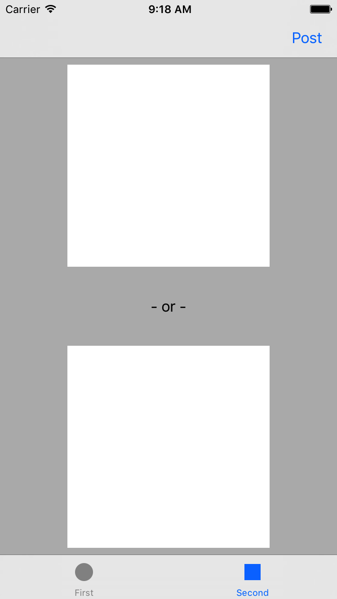
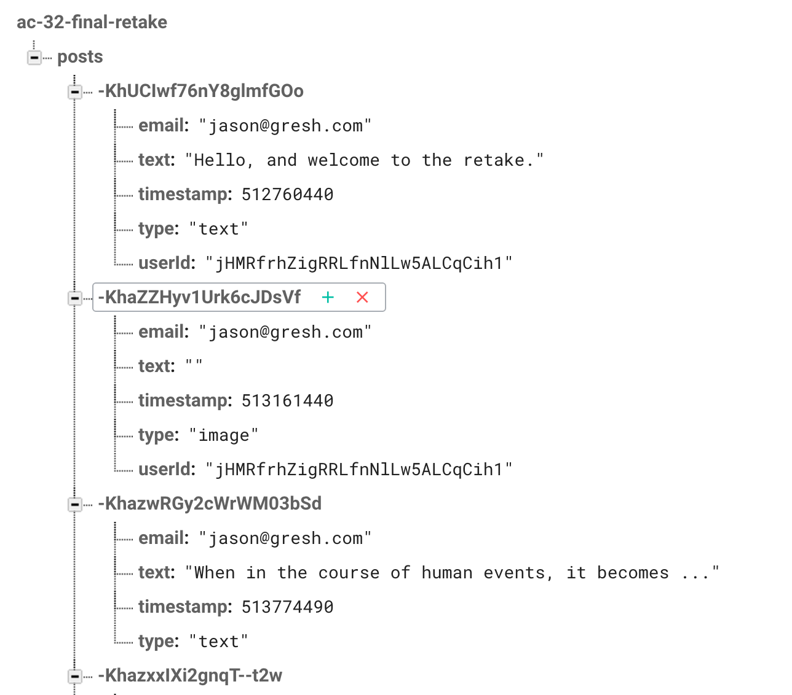
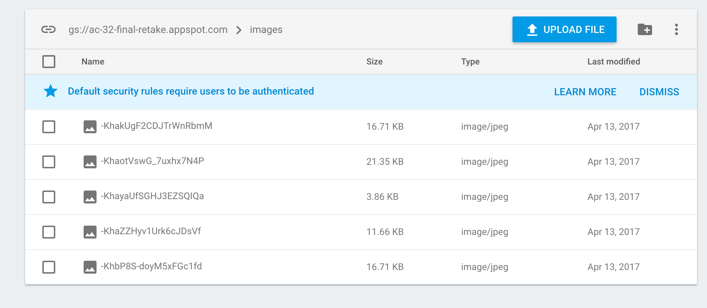

# AC3.2 Final-Retake - Practical

## Objective

Build an blog app for making image *OR* text posts.

## Summary

The app comprises three view controllers: a feed, an upload page and a login page.
 The designs to follow
will illustrate and specify the design and relationship of these view controllers
though *the design assets are not included and aren't necessary*.
 The backend is powered by Firebase. 
We will be working in a shared environment, reading and writing from the same database
and storage area. This is not unlike a real-world organization where, as a developer, you don't 
have full control of the data and therefore need to program defensively. Someone might create an
incomplete object or fail to establish a necessary connection between objects.

## Login

In contrast to the Unit 6 Project App which allowed limited anonymous usage, this app will
require the user to log in before he/she can access the rest of the app. 


## Main View: Feed

Each post in the feed has *either one* two elements (but not both): a picture or text. The picture is a fixed square the width
of the device and the text is variable height below it, resulting in non-uniform cell heights.
Therefore use Auto Layout to drive automatic cell heights.


## Upload View

The upload view had a square text entry view and a square image view. When the user taps on the
image view it  opens ```UIImagePickerController```. Upon selection the image is populated.
Upload will then uploand the image. If the text field is populated, text will be uploaded.

Be sure to keep these two fields mutually exclusive as the user is interacting with the view.




## XCode Workspace

* No assets are needed
* Includes the GoogleService-Info.plist needed to connect to Firebase
* Includes all necessary Firebase Pods
* Includes SnapKit
* Includes the default Storyboard. You can edit it to add your interface or build
	your interface programmatically

## Backend

### Authentication

Email/Password authentication is enabled so you can register and log users in. Anonymous
authentication is also enabled in case you need to fall back to it. 

### Database

The simple schema is illustrated by this diagram:



### Storage

The file structure of the storage is illustrated here: 



Note the relationship between image names and objects in the database.

#### Uploading Images

Be sure to render your images into compressed JPEG format as we did in the review.
Here's a line of code that takes a ```UIImage``` and generates a ```Data``` object
with JPEG data. 

```swift
let image: UIImage = ...obtain uiimage somehow...
let data = UIImageJPEGRepresentation(image, 0.5)
```
